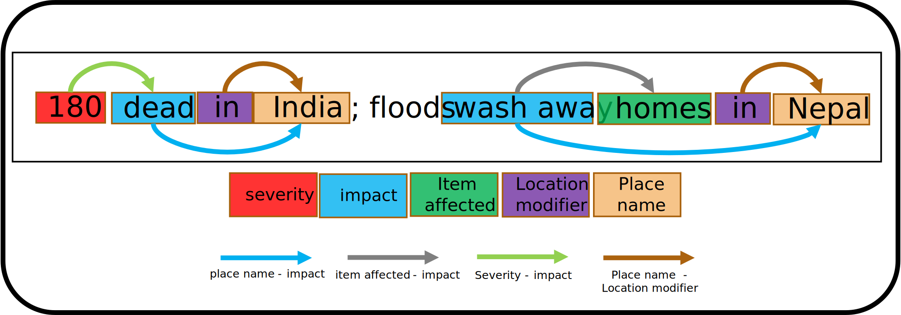

# QuaTRED
QuakeText Relation Extraction Dataset - Entity and relation annotated Twitter disaster dataset

This dataset provides an entity and relation annotated set of tweets on disaster events. Annotated with 5 types of entities and 4 different relations among the entites, this dataset is specially designed to train models that will help raise situational awareness in first responders. As an annotated corpus, this dataset can be used in the training of NLP models that can tackle the complex problem of relation extraction in informal English as is commonly found in Tweets. 

Entity | Description | 
--- | --- | 
place name | Identifies text that describes the location of the item damaged and the disaster impact area. This could be a city, town or a smaller location area.  | 
type of impact | Identifies the type of damage or impact that the item has encountered. For example, this could include malfunction, closure, or physical damage.  | 
item affected | Identifies the item that has been damaged from the disaster event. In different cases this could indicate people or animals, infrastructure such as buildings and roads, or services such as power and transport.  | 
severity or quantity | Identifies the scale of the damage impact on the item. For example, this could include duration, number impacted, or reference to complete or partial, or very severe or slight damage that the item has suffered. | 
location modifier | Often appearing just before the place name, identify text such as: in, at, near, around, on, outside, etc. which can describe the relationship of the place name location to the item damaged. |

Relation | Description | 
--- | --- | 
place_impact_rel |connects a type of impact to the place where the impact occurred| 
severity_impact_rel |connects a type of impact and its severity or quantity| 
item_impact_rel |connects an item affected to the type of impact| 
modifier_place_rel |connects a location modifier to the place it modifies| 
